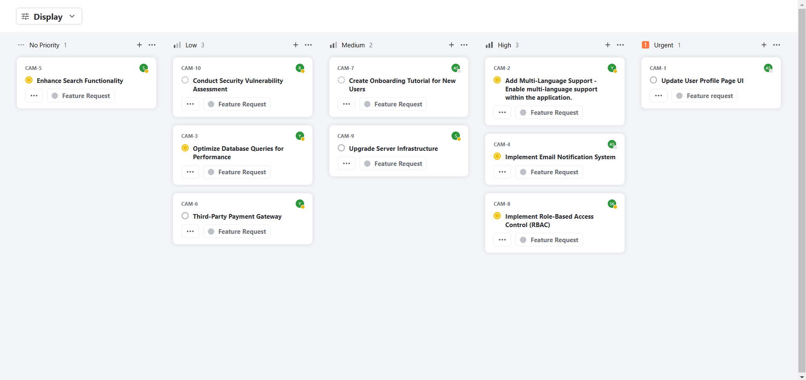
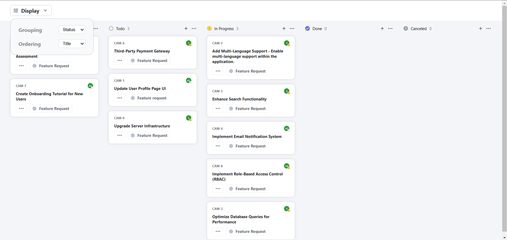

# 📌 Kanban Board Application - Frontend Assignment

This project is an interactive **Kanban board** built with **React JS**. The application organizes and displays tickets in multiple ways, allowing users to group and sort tickets based on criteria like status, assigned user, and priority. It provides a clean, responsive design that closely resembles the provided screenshots.

### Preview Screenshots




## 🚀 Features

### 1. Grouping Options
The board dynamically groups tickets based on user selection:
- **By Status**: Organize tickets by their current status.
- **By User**: Group tickets according to the assigned user.
- **By Priority**: Arrange tickets by priority level.

### 2. Sorting Options
Users can sort tickets within groups:
- **By Priority**: Sort tickets in descending priority order.
- **By Title**: Arrange tickets alphabetically by title.

### 3. State Persistence
The app saves the user's selected view, maintaining display preferences even after page reload.

## 📊 Priority Levels

The ticket priorities are color-coded and categorized as follows:
- **Urgent**: Level 4
- **High**: Level 3
- **Medium**: Level 2
- **Low**: Level 1
- **No Priority**: Level 0

## 📈 API Endpoint

Data is fetched from the following API:

```
https://api.quicksell.co/v1/internal/frontend-assignment
```


## 🖌️ Design & User Interface

The UI closely matches the provided designs, achieved through **pure CSS** without using any CSS libraries. The app is fully responsive and adapts well across various screen sizes.


## ⚙️ Technologies Used

- **Frontend**: React JS
- **Styling**: Pure CSS (Styled JSX allowed)

> **Note**: No CSS libraries or frameworks (like Bootstrap or Tailwind) and no frameworks beyond React (e.g., Next.js).

## 📝 Getting Started

### Prerequisites
Ensure you have **Node.js** installed.

### Installation
1. Clone the repository:
   ```bash
   git clone <repository-url>
   cd kanban-board
2. Install Dependencies:
    ```bash
    npm install
3. Run the App:
    ```bash
    npm start
    
The application should now be running locally at http://localhost:3000.

## 🧪 Evaluation Criteria


1. **Functionality**: Correct implementation of grouping, sorting, and persistence.
2. **UI Design**: Matching the provided screenshots.
3. **Code Structure**: Clean, reusable, and organized component structure.
4. **Optimization**: Efficient handling of API data and view settings.
